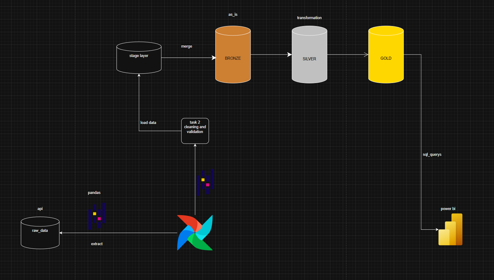

# Stock Market ETL Pipeline

A production-ready ETL pipeline for stock market data using **Apache Airflow**, **Yahoo Finance (yfinance)**, and **SQL Server** with a Medallion Architecture (Stage → Bronze → Silver → Gold).

## Architecture


```
yfinance API → Extract → Clean → Validate → Stage → Bronze → Silver → Gold
```

## Stack

| Component | Technology |
|---|---|
| Orchestration | Apache Airflow 3 (Docker) |
| Data Source | Yahoo Finance (yfinance) |
| Storage | SQL Server (Local) |
| Language | Python 3.12 |
| Architecture | Medallion (Stage/Bronze/Silver/Gold) |

## Project Structure

```
final_etl2/
├── airflow/
│   ├── dags/           # Airflow DAGs
│   └── docker-compose.yaml
├── config/
│   └── job_config.yaml # ETL job configuration
├── db/
│   └── ddl.sql         # SQL Server schema
├── src/
│   ├── extract/        # yfinance data extraction
│   ├── transformation/ # Cleaning & validation
│   ├── load/           # Stage & Bronze loading
│   └── utils/          # Config loader, logger
└── .env.example        # Environment variables template
```

## Setup

### 1. Clone the repo
```bash
git clone https://github.com/bob88p/stocks.git
cd stocks
```

### 2. Configure environment
```bash
cp .env.example .env
# Edit .env with your SQL Server credentials
```

### 3. Run Airflow (Docker)
```bash
cd airflow
docker-compose up airflow-init
docker-compose up -d
```

### 4. Access Airflow UI
- URL: http://localhost:8080
- Username: `admin`
- Password: `admin`

## Environment Variables

Create a `.env` file in the project root:

```env
DB_SERVER=host.docker.internal
DB_PORT=1433
DB_NAME=Stock_db
DB_USER=your_user
DB_PASSWORD=your_password
AIRFLOW_UID=50000
```

## DAG

The main DAG `medallion_stock_pipeline` runs the full pipeline:

```
extract → clean → check → load_stage → check_stage → merge → build_silver → load_silver → refresh_gold → cleanup
```
